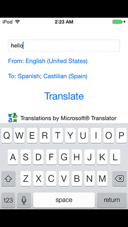

iOS.TranslateRecipe
===================

Xamarin.iOS recipe to translate text from one language and speak it in another

Introduction
-------
This sample shows how to take text in one language, translate it and speak it in another language. The translation is achieved using Microsoft Translator 

Setup
-------
1. Sample requires iOS 7
2. [Setting up Azure Marketplace & Microsoft Translator API](https://github.com/dannycabrera/iOS.TranslateRecipe/wiki/Setting-up-Azure-Marketplace-&-Microsoft-Translator-API)

[Using sample](https://github.com/dannycabrera/iOS.TranslateRecipe/wiki/Using-sample)
-------

Xamarin Components Used
-------
[BTProgressHUD](http://components.xamarin.com/view/btprogresshud/)
[Json.NET](http://components.xamarin.com/view/json.net/)

More information available on the [wiki](https://github.com/dannycabrera/iOS.TranslateRecipe/wiki)
